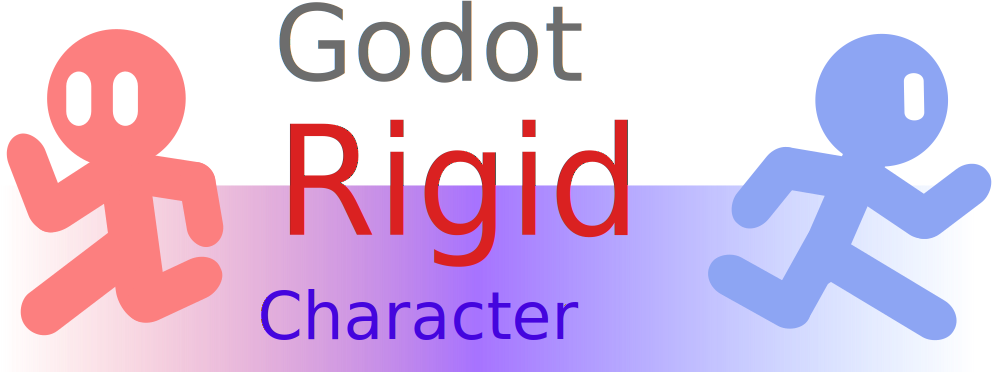

# Godot Rigid Character

<div align=center></div>

**A Godot addon that provides advanced `CharacterBody2D/3D`, `RigidCharacter2D/3D`, with more `RigidBody2D/3D` features ported.**

[Upgraded from Kinebody addon](https://github.com/Lazy-Rabbit-2001/godot-addon-kinebody)

## Godot Versions Supported

* Godot 4.4.x ~ 4.6.x

## Programming Languages Available

* GDScript 2.0
* C#

### Notes

> * The `RigidCharacter2D/3D` created from the Create Dialog is based on **GDScript**. To convert the rigid body node to C# version, please extend the C# class `RigidCharacter2D/3D` in your C# script and attach it to the rigid body node you created.

## About `RigidCharacter2D`/`RigidCharacter3D`

A rigid character is an instance of `RigidCharacter2D/3D` derived from `CharacterBody2D/3D`. Improved from the latter, the former is born with more features than the latter, most of which are ported from or inspired by `RigidBody2D/3D`. See [Features](#features) for more information

## Features

### Mass, Momentum, and Force

The concept of mass is ported from `RigidBody2D/3D`, which affects the momentum and/or force applied to the rigid body. For those who wants to simulate rigid body physics for characters bodies, they would love this.

### Motion, Up-direction, Rotation, related to Space Gravity

#### *Motion*

When making a game with multi-directional gravity environment, you will always be annoyed because we have to consider handling the complicated velocity in all directions of gravity. Now, you can just set the velocity in no matter which gravity direction as if you were doing it in the default gravity direction, by handling `motion` property.

If `motion_mode` is set to `GROUNDED`, the `velocity` converted from `motion` is always perpendicular to the up-direction; otherwise, the converted `velocity` will follow the `global_rotation` of the rigid character.

#### *Rotation and Up-direction in Special Gravity Environment*

It's not enough, because the character will always rotate to a decent angle so that it will not look like as weird as an alien. Fortunately, when a rigid character is moving in a space with special direction of gravity, it will automatically rotate to the angle so that its looking direction will always be perpendicular to the gravity direction of the space.

While the rotation is handled gracefully, the up-direction, a property decides the effect of `motion`, is still a problem. Hence, the `RigidCharacter2D/3D`, by default, sets the `up_direction` to be opposite to the gravity direction of the space. You can also disable the rule by modifying `up_direction_base`.

### Move, and Move!

#### *Call `move()` Method*

To make a rigid character move as expected with the previous features available, you should always call `move()` method provided. The method encapsulates all necessary implementation that drives the rigid character to move well. Since the method `move()` has implemented the call of `move_and_slide()`, you don't need to call it repeatedly.

Meanwhile, it supports customize the speed scale of the movement, by just passing `speed_scale` parameter with a float value you want.

#### *We Need More Customization*

You can also customize your own movement algorithm by overriding `_move()` method in the subclasses.

##### *Notes*

> When you want to call `move()` of the original `RigidCharacter2D` in the subclasses, you should leave a wrapper method to call it:

```GDScript
class Sub1 extends RigidCharacter2D:
    func _move(speed_scale: float = 1.0) -> void:
        ...
	
	# Calls the original move() method
	func move_original(speed_scale: float = 1.0) -> void:
		super.move(speed_scale)

class Sub2 extends Sub1:
	# Overrides _move() method
	func _move(speed_scale: float = 1.0) -> void:
		...
	
	# Calls the original move() method
	func move_original(speed_scale: float = 1.0) -> void:
		super.move_original(speed_scale)
```

### And More!

There are more properties and methods available for you to explore, and you can see its in-engine documentation for more details.

### Credits

* Yukana(Me): Main programminer, maintainer, designer.
* Ghostyii, militaryg: Inspiration for rotation handling in 3D space.